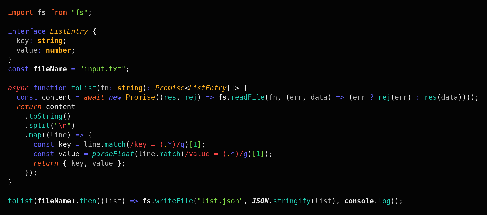

# README

Colorful theme loosely based on the Rainglow Vision Theme.
Includes support for some semantic highlighting.

#### NOTE:

If you don't like italic and bold highlighting, this is not a theme for you.
It relies heavily on bold text for global constants, imports and primitive types.
Italics are used to differentiate Interfaces from classes, comments, control flow, modifiers and operators, decorators.
Italics are also used to mark support function, for example to better see Promise .then() / .catch().
