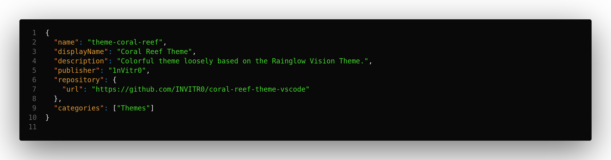
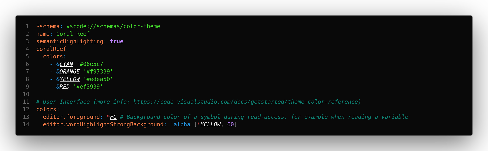
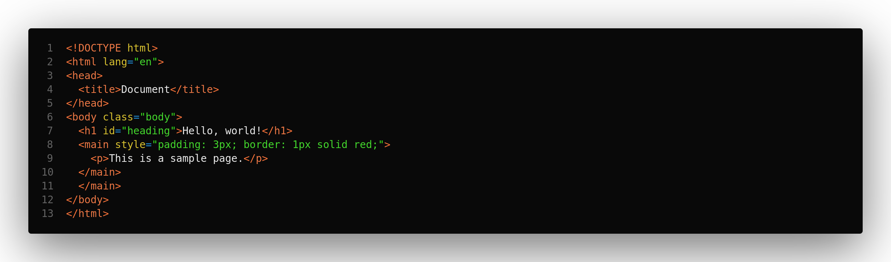
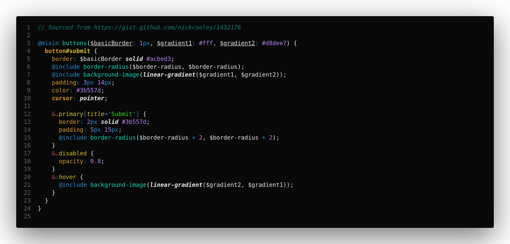

# Coral Reef Theme

<b style="color: #EBEBEB">C</b><b style="color: #06e5c7">o</b><b style="color: #1EE85B">l</b><b style="color: #ed9a26">o</b><b style="color: #edea50">r</b><b style="color: #1392E8">f</b><b style="color: #ef3939">u</b><b style="color: #b87aff">l</b>

theme loosely based on the <a href="https://github.com/rainglow/vscode">Rainglow Vision</a> Theme.

## Included Themes

- `Coral Reef`: Base theme with both **bold** and *italic* markup
- `Coral Reef Flat`: Base theme without font style markup
- `Coral Reef Muted`: Less saturated variant with both **bold** and *italic* markup
- `Coral Reef Muted Flat`: Less saturated variant without font style markup

## Language Support

Supports all major languages including additional semantic highlighting. Include extended support for regular expression highlighting. Developed with focus on:

- `JavaScript`
- `TypeScript`
- `HTML`
- `CSS` / `SCSS` / `SASS`
- `PHP`
- `JSON` / `YAML`
- `Markdown`

## Syntax Highlighting Examples

> `JSON`:
> 

> `YAML`:
> 

> `HTML`:
> 

> `CSS`:
> 

## Contributions

- Originally based on the `Vision` theme from the [Rainglow Theme Pack](https://github.com/rainglow/vscode) by [Dayle Rees](https://github.com/daylerees)
- The build process and theme file are majorly based on the [Draculy Theme](https://github.com/dracula/visual-studio-code) by [Derek S.](https://github.com/dsifford)

## Maintainer

This theme is maintained by the following person:

 |
:---: |
[Aram Becker](https://github.com/1nVitr0) |